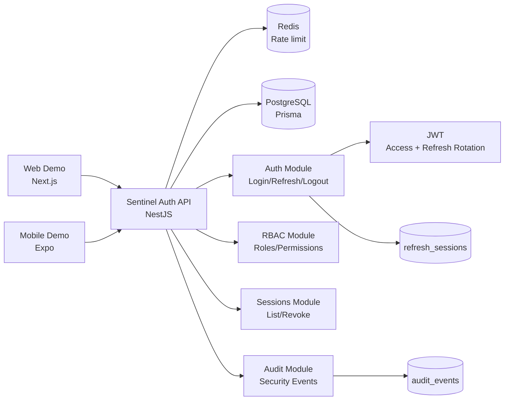

# Auth Unificado (Central Auth Service)

Serviço centralizado de **autenticação e autorização (RBAC)** para múltiplas aplicações (Web + Mobile + APIs internas), com foco em **segurança prática**, **padronização**, **auditoria** e **observabilidade**.

> Objetivo: ser um “Cerberus-like” open-source, mostrando arquitetura e decisões de nível Senior.

---

## Por que este projeto existe (problemas que resolve)

### 1) Autenticação duplicada e inconsistente

- Cada sistema implementa login/refresh/logout de forma diferente.
- Resultado: fluxos quebrados, regras divergentes e custo alto de manutenção.

**Solução:** um único serviço padrão (Auth Unificado) atendendo vários clientes via `appId`.

### 2) Permissões espalhadas e difíceis de governar

- Roles e permissões variam por sistema e ficam “hardcoded”.

**Solução:** RBAC por aplicação (multi-app) com `roles`, `permissions` e guards por rota.

### 3) Tokens inseguros e sessões difíceis de invalidar

- Refresh token sem rotação e sem revogação efetiva vira risco.

**Solução:** Access Token curto + Refresh Token com **rotação** + revogação e detecção de reuse.

### 4) Difícil investigar incidentes de autenticação

- Sem trilha de auditoria e sem correlação ponta a ponta.

**Solução:** auditoria no banco + logs estruturados + `correlationId` por request.

---

## Stack

### Backend

- Node.js + TypeScript
- NestJS
- PostgreSQL
- Redis (rate limit e controles de segurança)
- Prisma (ORM)
- JWT (access/refresh)

### Observabilidade

- Logs estruturados (pino)
- Sentry (opcional)

### Demos (clientes)

- Next.js (web)
- React Native + Expo (mobile)

---

## Arquitetura (resumo)

### Domínios

- `auth`: login/refresh/logout e sessões
- `users`: usuários, status, credenciais
- `rbac`: roles, permissions, user_roles
- `audit`: eventos de autenticação e segurança
- `common`: interceptors, utils, correlationId, errors

### Padrões e decisões

- DTO + validation em todas entradas (class-validator)
- Service layer por domínio com acesso ao banco via Prisma
- Guards para autenticação e autorização
- Auditoria sempre que:
  - login success/fail
  - refresh
  - logout / revoke
- Segurança por default:
  - Access token curto
  - Refresh token rotacionado e armazenado como hash
  - Rate limiting em endpoints sensíveis
  - Headers via helmet

### Diagrama de arquitetura



---

## Funcionalidades (MVP)

### Autenticação

- `POST /auth/login`
- `POST /auth/refresh` (rotation + reuse detection)
- `POST /auth/logout` (revoga sessão atual)
- `POST /auth/logout-all` (revoga todas as sessões do usuário para um app)

### Autorização (RBAC)

- Permissões por aplicação (`appId`)
- Decorator/guard para rotas: `@RequirePermissions('orders.read')`
- Endpoints protegidos por RBAC:
  - `GET /me` requer `user.read`
  - `GET /sessions` requer `sessions.read`
  - `POST /sessions/revoke` requer `sessions.revoke`

### Auditoria

- Eventos persistidos: `LOGIN_SUCCESS`, `LOGIN_FAIL`, `REFRESH`, `LOGOUT`, `LOGOUT_ALL`, `REFRESH_REUSE_DETECTED`

---

## Modelo de dados (sugestão)

Tabelas:

- `users (id, name, email, password_hash, status, created_at)`
- `apps (id, name, slug)`
- `roles (id, app_id, name)`
- `permissions (id, app_id, key)`
- `role_permissions (role_id, permission_id)`
- `user_roles (user_id, role_id)`
- `refresh_sessions (id, user_id, app_id, token_hash, expires_at, revoked_at, user_agent, ip, created_at)`
- `audit_events (id, type, user_id, app_id, ip, user_agent, correlation_id, created_at, metadata jsonb)`

---

## Segurança (MVP)

- Hash forte para senha (bcrypt ou argon2)
- Access token curto (ex: 15 min)
- Refresh token longo (ex: 30 dias) com:
  - rotação a cada refresh
  - armazenamento como **hash**
  - detecção de reuse (se refresh antigo for usado novamente → revoga sessões)
- Rate limit nos endpoints:
  - login
  - refresh
- Logs sem secrets

---

## Como rodar localmente (Docker)

### Requisitos

- Node 20+
- Docker + Docker Compose

### 1) Subir Postgres + Redis

```bash
docker compose up -d
```

### 2) Configurar env

Copie `apps/api/.env.example` para `apps/api/.env` e ajuste se necessário:

```bash
cp apps/api/.env.example apps/api/.env
```

Configuração importante:

- `CORS_ALLOWED_ORIGINS`: lista separada por vírgula com origins permitidos (web/Expo)
- `TRUST_PROXY`: habilite quando a API rodar atrás de proxy/load balancer

### 3) Instalar dependências e migrar DB

```bash
npm install
npm run db:migrate
npm run db:seed
```

Limpeza de auditoria (opcional):

```bash
npm run db:audit:cleanup --workspace apps/api -- 90
```

### 4) Rodar API

```bash
npm run dev --workspace apps/api
```

API em: `http://localhost:3000`

### 5) Rodar demos (opcional)

Web demo (Next.js):

```bash
cp apps/web-demo/.env.example apps/web-demo/.env.local
npm run dev --workspace apps/web-demo
```

Mobile demo (Expo):

```bash
cp apps/mobile-demo/.env.example apps/mobile-demo/.env
npm run dev --workspace apps/mobile-demo
```

Observação Expo (API URL):

- iOS simulator: `http://localhost:3000`
- Android emulator: `http://10.0.2.2:3000`
- dispositivo físico: use o IP da máquina host

---

## Endpoints (exemplos)

### Login

`POST /auth/login`

`Content-Type: application/json`

```json
{
  "email": "user@exemplo.com",
  "password": "senha-forte",
  "appId": "demo-web"
}
```

Resposta (exemplo):

```json
{
  "accessToken": "...",
  "refreshToken": "...",
  "user": { "id": "...", "email": "...", "name": "..." }
}
```

### Refresh (rotaciona refresh token)

`POST /auth/refresh`

`Authorization: Bearer <refreshToken>`

### Logout

`POST /auth/logout`

`Authorization: Bearer <refreshToken>`

### Health check

`GET /health`

### Readiness check (dependências)

`GET /readiness`

### Documentação OpenAPI (Swagger)

`GET /docs`

### Listar sessões (RBAC)

`GET /sessions`

`Authorization: Bearer <accessToken>`

### Revogar sessão específica (RBAC)

`POST /sessions/revoke`

`Authorization: Bearer <accessToken>`

```json
{
  "sessionId": "uuid-da-sessao"
}
```

---

## Observabilidade

- `correlationId` em toda request (header `x-correlation-id` ou gerado automaticamente)
- Logs estruturados contendo:
  - `correlationId`, `appId`, `userId` (quando aplicável), `route`, `status`
- Audit events gravados no banco para investigação de incidentes

---

## Roadmap

### MVP

- [x] auth (login/refresh/logout/logout-all)
- [x] RBAC por app (roles/perms)
- [x] audit events
- [x] rate limit
- [x] docker compose (postgres + redis)
- [x] seed com app demo + role + user
- [x] demo web (Next.js) e demo mobile (Expo) consumindo API

### Próximos passos

- [ ] reset password
- [ ] admin endpoints (crud roles/perms)
- [ ] device/session management (listar sessões)
- [ ] integração Sentry opcional
